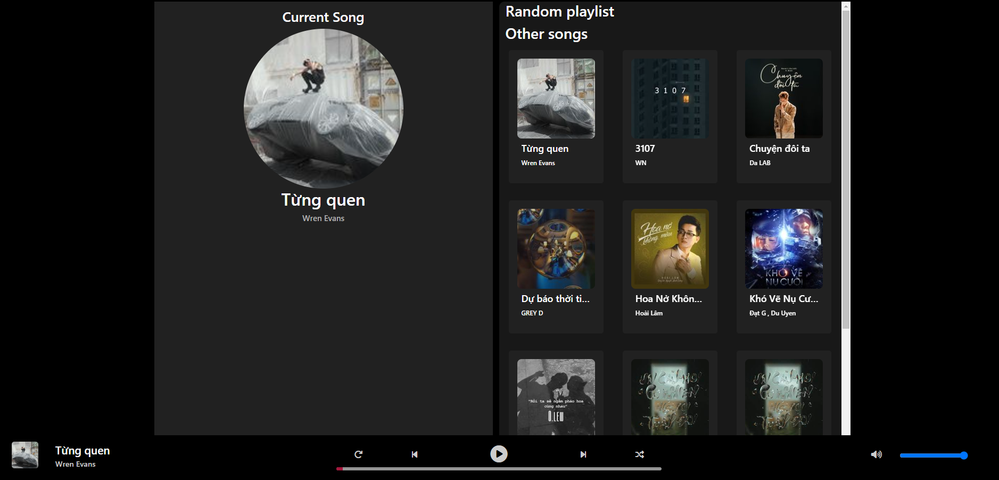

Description
A simple project using HTML, CSS and JS for playing music based on Spotify's UI

Main Functions
Play/Stop music
Shuffle songs
Change song's progress
Next/Back
Repeat
Change Volume

link to see https://sindy0711.github.io/code-music-player/